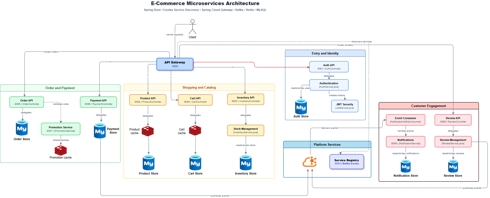
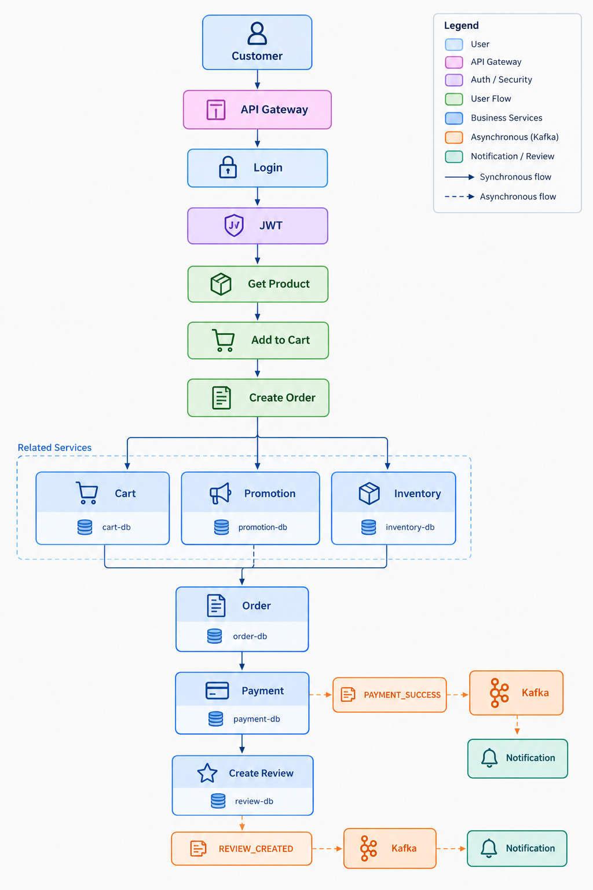

# E-commerce Shop

The backend of the E-commerce system is built using a **Microservices architecture** with **Java Spring Boot**.

The project simulates a real-world e-commerce system, where functionality is divided into multiple independent services. The services communicate with each other through **REST APIs / OpenFeign**, with **Eureka** used for service discovery, **API Gateway** as the entry point, **Kafka** for event-driven communication, and **Redis** for caching.

## Table of Contents

- [System Overview](#system-overview)
- [Technology Stack](#technology-stack)
- [Backend Architecture](#backend-architecture)
- [Services in the System](#services-in-the-system)
- [Folder Structure](#folder-structure)
- [Kafka](#kafka)
- [Redis](#redis)
- [Microservices vs Monolithic](#microservices-vs-monolithic)
- [Docker Infrastructure](#docker-infrastructure)
- [Running the Backend](#running-the-backend)
- [Notes / Troubleshooting](#notes--troubleshooting)

---

## System Overview

The system includes the following key features:

- Authentication / Authorization
- Product Management
- Inventory Management
- Shopping Cart
- Order Management
- Payment
- Promotion Management
- Product Reviews
- Notifications
- Service Discovery
- API Gateway
- Event-Driven Architecture
- Caching

**Overall architecture:** 



---

## Technology Stack

### Frontend

- Processing ...

### Backend

- Java 17
- Spring Boot
- Spring Web
- Spring Data JPA
- Spring Cloud
- Spring Cloud Netflix Eureka
- Spring Cloud Gateway
- Spring Cloud OpenFeign
- Spring Security / JWT
- Spring Kafka
- Spring Data Redis
- Lombok
- MySQL

### Infrastructure

- Docker
- Docker Compose
- MySQL 8.4
- Redis 7.4
- Apache Kafka 4.0
- Eureka Server

### Development

- IntelliJ IDEA
- Visual Studio Code
- Postman
- Git / GitHub

---

## Backend Architecture

The backend is divided into independent services:

| Service              | Port | Database                | Function                |
| -------------------- | ---- | ----------------------- | ----------------------- |
| Eureka Server        | 8761 | -                       | Service Discovery       |
| API Gateway          | 8080 | -                       | Entry point / Routing   |
| Auth Service         | 8081 | `ecommerce_auth`         | Authentication          |
| Product Service      | 8082 | `ecommerce_product`      | Product management      |
| Inventory Service    | 8083 | `ecommerce_inventory`    | Inventory management    |
| Cart Service         | 8084 | `ecommerce_cart`         | Shopping cart           |
| Order Service        | 8085 | `ecommerce_order`        | Order management        |
| Payment Service      | 8086 | `ecommerce_payment`      | Payment                 |
| Promotion Service    | 8087 | `ecommerce_promotion`    | Promotion / Discount    |
| Review Service       | 8088 | `ecommerce_review`       | Product reviews         |
| Notification Service | 8089 | `ecommerce_notification` | Notifications           |
| Redis                | 6379 | -                       | Caching                 |
| Kafka                | 9092 | -                       | Event streaming         |

---

## Services in the System

### Eureka Server

- Port: **8761**
- Responsible for **Service Discovery**.

Instead of requiring each service to know the exact address of the other services:

```
http://localhost:8082
http://localhost:8083
http://localhost:8085
```

services can discover and communicate with each other through Eureka using logical names:

```
PRODUCT-SERVICE
ORDER-SERVICE
INVENTORY-SERVICE
```

Example:

```
Order Service
      │ find Inventory Service
      ▼
    Eureka
      │
      ▼
INVENTORY-SERVICE
```

Eureka allows services to easily discover and communicate with each other in a microservices environment, without relying on fixed service addresses.

### API Gateway

- Port: **8080**
- Serves as the **single entry point** to the backend system.
- The frontend does not need to communicate directly with each individual service.

Instead of:

```
Frontend
 ├── localhost:8081
 ├── localhost:8082
 └── ...
```

the frontend should go through the gateway:

```
Frontend
     │
     ▼
API Gateway :8080
     │
     ├── /api/auth/**
     ├── /api/products/**
     └── ...
```

The API Gateway uses Eureka to discover and route requests to the corresponding services.

### Auth Service

Responsible for user authentication and generating **JWT access tokens**.

- Port: **8081**
- Database: `ecommerce_auth`
- Functions:
  - Register / Login
  - User information
  - Role
- Roles:
  - `CUSTOMER`
  - `SELLER`
  - `STAFF`: staff responsible for order processing and inventory management
  - `ADMIN`: manages the whole system

### Product Service

Uses **Redis** to cache product data.

- Port: **8082**
- Database: `ecommerce_product`
- Functions:
  - CRUD product
  - Change product status

Example:

```
GET /api/products/1
        ↓
      Redis
   ┌────┴────┐
  HIT       MISS
   │         │
   ▼         ▼
Return     MySQL
             │
             ▼
           Redis
```

### Inventory Service

- Port: **8083**
- Database: `ecommerce_inventory`
- Functions:
  - Manage product quantity
  - Check inventory
  - Reserve stock
  - Release stock
  - Stock movement types: `IN`, `OUT`, `RESERVE`, `RELEASE`

Example — creating an order:

```
Order Service
      │ reserve quantity
      ▼
Inventory Service
      │
      ▼
reserved_quantity += quantity
```

Example — order is cancelled:

```
Order Cancelled
      │
      ▼
Inventory Release
      │
      ▼
reserved_quantity -= quantity
```

### Cart Service

- Port: **8084**
- Database: `ecommerce_cart`
- Functions:
  - View cart
  - Add items to cart
  - Delete cart
  - Manage cart items
- Cache key: `cart:user:{userId}`

### Order Service

- Port: **8085**
- Database: `ecommerce_order`
- Functions:
  - Create order
  - View order
  - View orders by user
  - Mark order as paid
- Order status: `PENDING_PAYMENT`, `PAID`, `CANCELLED`
- Communicates with: Cart Service, Product Service, Inventory Service, Promotion Service, Payment Service

Flow to create an order:

```
Customer
   │
   ▼
Order Service
   │
   ├── Get Cart
   ├── Get Product
   ├── Validate Promotion
   ├── Reserve Inventory
   ├── Calculate Total
   ├── Save Order
   └── Clear Cart
```

### Payment Service

- Port: **8086**
- Database: `ecommerce_payment`
- Functions:
  - Create payment
  - Confirm payment
  - Manage payment method/status: `COD`, `BANK_TRANSFER`, `MOCK`
- In the current project, **Mock Payment** is used to simulate the payment process.

Payment flow:

```
Order
  │
  ▼
Payment Service
  │
  ▼
MOCK Payment
  │
  ▼
SUCCESS
  │
  ▼
Order Service
  │
  ▼
Order = PAID
```

### Promotion Service

Uses **Redis** to cache promotions.

- Port: **8087**
- Database: `ecommerce_promotion`
- Functions:
  - CRUD promotion
  - Change promotion status: Active / Deactive
  - Validate promotion
  - Calculate discount (discount types: `PERCENTAGE` and `FIXED`)
- Cache key: `promotion:{promotionCode}`

When validating:

```
Validate Promotion
       │
       ▼
     Redis
    /     \
  HIT     MISS
   │        │
   │       MySQL
   │        │
   │        ▼
   │      Redis
   │        │
   └────────┘
       │
       ▼
Calculate Discount
```

### Review Service

- Port: **8088**
- Database: `ecommerce_review`
- Functions:
  - CRUD review
  - Approve / Reject review
- Review status: `PENDING`, `APPROVED`, `REJECTED`
- Review Service checks Order Service to confirm that the user has already purchased the product.

Review flow:

```
User
 │
 ▼
Review Service
 │
 ├── Check Order
 ├── Check User
 ├── Check Product
 └── Create Review
```

### Notification Service

- Port: **8089**
- Database: `ecommerce_notification`
- Functions:
  - CRUD notification
  - View unread notifications
  - Count unread notifications
  - Mark all as read
- Integrated with **Kafka**.

```
Order Created
      │
      ▼
    Kafka
      │
      ▼
Notification Service
      │
      ▼
Create Notification
```

---

## Folder Structure

Each business service is organized using a **Layered Architecture**.

### `controller/`

- Receives HTTP requests from the client.
- Should not contain complex business logic.

```
HTTP Request
     ↓
Controller
     ↓
Service
```

### `service/`

- Contains business logic only.

### `repository/`

- Communicates with the database through Spring Data JPA.

```
Service
   ↓
Repository
   ↓
MySQL
```

### `entity/`

- Represents a database table.

### `dto/`

- DTO = Data Transfer Object.
- Used to transfer data between:

```
Client
   ↕
Controller
   ↕
Service
   ↕
Other Services
```

### `config/`

- Contains service configuration, for example: `RedisConfig`, `KafkaConfig`, `SecurityConfig`, ...

---

## Kafka

Apache Kafka is an event streaming platform that enables services to exchange data through events.

Kafka allows the system to process events asynchronously, providing better scalability while reducing direct dependencies between services.

In this project, Kafka is used to implement an **Event-Driven Architecture**, allowing services to communicate through events instead of making direct HTTP calls.

- Kafka runs on `localhost:9092`.
- After Kafka is running, create 3 topics: order, payment and review.

```bash
docker exec -it ecommerce-kafka /opt/kafka/bin/kafka-topics.sh \
  --create \
  --topic order-events \
  --bootstrap-server localhost:9092 \
  --partitions 1 \
  --replication-factor 1

docker exec -it ecommerce-kafka /opt/kafka/bin/kafka-topics.sh \
  --create \
  --topic payment-events \
  --bootstrap-server localhost:9092 \
  --partitions 1 \
  --replication-factor 1

docker exec -it ecommerce-kafka /opt/kafka/bin/kafka-topics.sh \
  --create \
  --topic review-events \
  --bootstrap-server localhost:9092 \
  --partitions 1 \
  --replication-factor 1
```

Main topics:

- `order-events`
- `payment-events`
- `review-events`

Example — creating an order:

```
Order Service
      │
      ▼
ORDER_CREATED
      │
      ▼
order-events
      │
      ▼
Notification Service
```

**Benefits of using Kafka:**

- Reduces coupling
- Asynchronous architecture
- Event-driven architecture
- Easy to scale by adding more consumers
- New services can be added without modifying the producer

---

## Redis

Redis is an in-memory data store commonly used to implement caching mechanisms for faster data retrieval.

Redis reduces the number of direct database accesses, thereby lowering system load and improving application response times.

In this project, Redis is used as a cache for frequently accessed data such as **Products**, **Carts**, and **Promotions**.

- Redis runs on `localhost:6379`.
- Main cache keys:
  - `product:{id}`
  - `cart:user:{userId}`
  - `promotion:{code}`

Example — getting a product:

```
GET Product
     │
     ▼
   Redis
  /     \
HIT     MISS
 │        │
 ▼        ▼
Return   MySQL
           │
           ▼
         Redis
```

**Benefits of using Redis:**

- Reduces database load
- Improves read performance
- Reduces latency
- Supports systems with a high volume of requests

Redis in this project uses the **Cache-Aside Pattern**.

---

## Microservices vs Monolithic

|                   | Advantages                                                                                                                       | Disadvantages                                                                                                                                                                                                                                  |
| ----------------- | -------------------------------------------------------------------------------------------------------------------------------- | ---------------------------------------------------------------------------------------------------------------------------------------------------------------------------------------------------------------------------------------------- |
| **Monolithic**    | Easy to get started; easy to develop for small projects; easy to deploy; simple communication                                   | Large codebase; difficult to scale individual modules; modules can become tightly coupled; a failure in one module can affect the entire application; changes to one module usually require redeploying the entire application                 |
| **Microservices** | Separation of responsibility; independent deployment; independent scaling; technology flexibility; fault isolation               | More complex architecture; communication between services needs to be managed; deployment and monitoring are more complex; requires handling distributed system challenges                                                                    |

---

## Docker Infrastructure

Docker Compose is used to run the system infrastructure.

The main containers are:

- `ecommerce-mysql`
- `ecommerce-redis`
- `ecommerce-kafka`

To check the running containers:

```bash
docker ps
```

---

## Running the Backend

### Step 1: Clone the project

```bash
git clone <repository-url>
cd backend
```

### Step 2: Start Docker

```bash
docker compose up -d
docker ps
```

The following containers must be running:

- `ecommerce-mysql`
- `ecommerce-redis`
- `ecommerce-kafka`

### Step 3: Check MySQL

- Host: `localhost:3306`
- Username: `ecommerce`
- Password: `Password123`

Run the following commands (PowerShell) to create the schemas and load seed data:

```powershell
Get-Content .\docker\mysql\auth\schema.sql -Raw | docker exec -i ecommerce-mysql mysql -u root -proot
Get-Content .\docker\mysql\auth\seedData.sql -Raw | docker exec -i ecommerce-mysql mysql -u root -proot

Get-Content .\docker\mysql\product\schema.sql -Raw | docker exec -i ecommerce-mysql mysql -u root -proot
Get-Content .\docker\mysql\product\seedData.sql -Raw | docker exec -i ecommerce-mysql mysql -u root -proot

Get-Content .\docker\mysql\inventory\schema.sql -Raw | docker exec -i ecommerce-mysql mysql -u root -proot
Get-Content .\docker\mysql\inventory\seedData.sql -Raw | docker exec -i ecommerce-mysql mysql -u root -proot

Get-Content .\docker\mysql\cart\schema.sql -Raw | docker exec -i ecommerce-mysql mysql -u root -proot
Get-Content .\docker\mysql\cart\seedData.sql -Raw | docker exec -i ecommerce-mysql mysql -u root -proot

Get-Content .\docker\mysql\order\schema.sql -Raw | docker exec -i ecommerce-mysql mysql -u root -proot
Get-Content .\docker\mysql\order\seedData.sql -Raw | docker exec -i ecommerce-mysql mysql -u root -proot

Get-Content .\docker\mysql\payment\schema.sql -Raw | docker exec -i ecommerce-mysql mysql -u root -proot
Get-Content .\docker\mysql\payment\seedData.sql -Raw | docker exec -i ecommerce-mysql mysql -u root -proot

Get-Content .\docker\mysql\promotion\schema.sql -Raw | docker exec -i ecommerce-mysql mysql -u root -proot
Get-Content .\docker\mysql\promotion\seedData.sql -Raw | docker exec -i ecommerce-mysql mysql -u root -proot

Get-Content .\docker\mysql\review\schema.sql -Raw | docker exec -i ecommerce-mysql mysql -u root -proot
Get-Content .\docker\mysql\review\seedData.sql -Raw | docker exec -i ecommerce-mysql mysql -u root -proot

Get-Content .\docker\mysql\notification\schema.sql -Raw | docker exec -i ecommerce-mysql mysql -u root -proot
Get-Content .\docker\mysql\notification\seedData.sql -Raw | docker exec -i ecommerce-mysql mysql -u root -proot
```

### Step 4: Check Redis

```bash
docker exec -it ecommerce-redis redis-cli
```

Run `PING` → expected result: `PONG`.

Check the cache with `KEYS *`. Example keys:

```
product:1
cart:user:1
promotion:WELCOME10
```

### Step 5: Check Kafka

```bash
docker ps
```

Kafka runs on `localhost:9092`. Topics:

- `order-events`
- `payment-events`
- `review-events`

### Step 6: Start Eureka Server

- Run `eureka-server` (port `8761`).
- Open <http://localhost:8761>.
- Check that services register successfully.

### Step 7: Start the services

It is recommended to start them in the following order:

1. Eureka Server
2. API Gateway
3. Auth Service
4. Product Service
5. Inventory Service
6. Cart Service
7. Order Service
8. Payment Service
9. Promotion Service
10. Review Service
11. Notification Service

### Step 8: Verify in Eureka

Return to the Eureka dashboard and check that all services have status **UP**.

### Step 9: Test the API

After the API Gateway is running, use Postman with the base URL `http://localhost:8080/`.

Example:

```
GET http://localhost:8080/api/products
```

### Complete E-commerce Flow



---

## Notes / Troubleshooting

If you get an error about `ecommerce%...` (MySQL access denied for user `ecommerce`) when running another service, do the following:

1. Return to the Docker CMD in `backend` and open the MySQL shell:

   ```bash
   docker exec -it ecommerce-mysql mysql -u root -proot
   ```

2. Copy and paste all the lines below, then press Enter:

   ```sql
   CREATE USER IF NOT EXISTS 'ecommerce'@'%' IDENTIFIED BY 'password123';
   GRANT ALL PRIVILEGES ON ecommerce_auth.* TO 'ecommerce'@'%';
   GRANT ALL PRIVILEGES ON ecommerce_product.* TO 'ecommerce'@'%';
   GRANT ALL PRIVILEGES ON ecommerce_inventory.* TO 'ecommerce'@'%';
   FLUSH PRIVILEGES;
   ```

3. Type `exit`.

Once all steps are complete, return to the service that failed, run it again, and continue with the remaining services.
